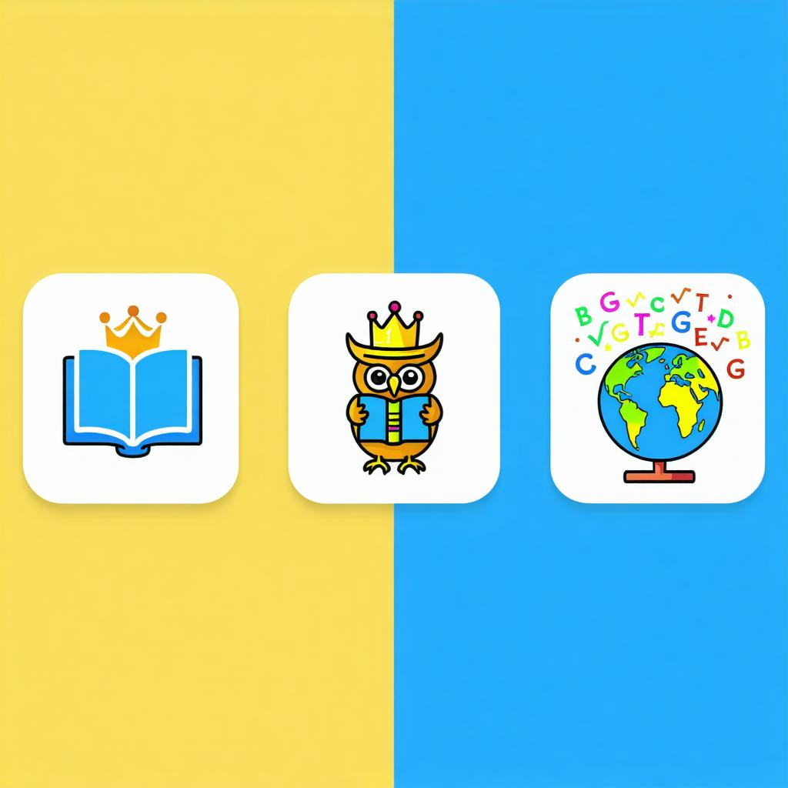

# Kings Of Vocab

**Version:** 1.3.10

## Description

Kings Of Vocab is a Chrome extension designed to help you save and learn new vocabulary effortlessly. Simply double-click any word on a webpage to save it. The extension highlights your saved words across all pages and provides detailed definitions and phonetics on hover.

## Features

- **Save Words by Double-Clicking:** Quickly save any word by double-clicking it on any webpage.
- **Highlight Saved Words:** All saved words are highlighted across all visited pages for easy recognition.
- **Detailed Definitions:** Hover over highlighted words to see phonetics, meanings, synonyms, antonyms, and example sentences.
- **Remove Words Easily:** Click on a highlighted word to remove it from your saved list.
- **Popup Word List:** Access your saved words from the extension popup, showing word details and allowing management.
- **Export Words:** Export your saved words and their definitions to a text file for offline study.
- **Clear All Words:** Clear your entire saved word list with a single click.
- **Update Highlights:** Manually refresh highlights on all open tabs from the popup.

## Installation

1. Download or clone this repository.
2. Open Google Chrome and navigate to `chrome://extensions/`.
3. Enable **Developer mode** (toggle in the top right).
4. Click **Load unpacked** and select the folder containing this extension.
5. The Kings Of Vocab extension should now appear in your toolbar.

## Usage

- **Saving Words:** Double-click any word on a webpage to save it. The word will be highlighted immediately.
- **Viewing Definitions:** Hover over any highlighted word to see its detailed definition, phonetic transcription, synonyms, antonyms, and example sentences.
- **Removing Words:** Click on a highlighted word to remove it from your saved list.
- **Managing Words:** Click the extension icon to open the popup. Here you can:
  - View all saved words with their phonetics and first definition.
  - Delete individual words using the "X" button.
  - Export all saved words to a text file.
  - Clear all saved words.
  - Update highlights on all open tabs.

## Permissions

- Access to storage for saving your words.
- Access to active tabs and scripting to highlight words and interact with pages.
- Unlimited storage to save your vocabulary list.

## Screenshots

*Note: The above image is the extension icon. The popup displays your saved words and controls.*

## License

This project is open source and available under the MIT License.

---

Enjoy expanding your vocabulary with Kings Of Vocab!
